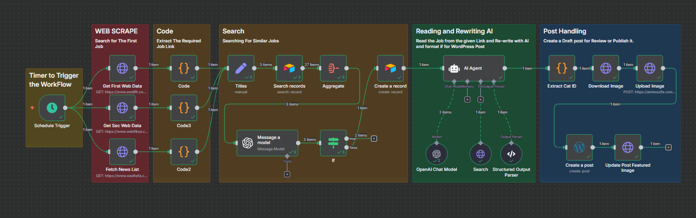

# Job Scraper Automation 🤖

An intelligent n8n workflow that automatically scrapes job postings from multiple sources, rewrites them using AI, and publishes them to WordPress with proper categorization and formatting.

## 🌟 Features

- **Multi-Source Scraping**: Automatically scrapes job postings from:
  - wadhefa.com
  - ewdifh.com
  - wdeftksa.com
- **AI-Powered Content Generation**: Uses OpenAI GPT-4.1-mini to rewrite job postings in Arabic
- **Duplicate Detection**: Intelligent similarity checking to avoid publishing duplicate jobs
- **Automatic WordPress Publishing**: Creates draft posts with featured images and proper categorization
- **Image Handling**: Downloads and uploads job-related images to WordPress media library
- **Category Mapping**: Automatically categorizes jobs based on sector, location, and type
- **Data Storage**: Tracks published jobs using Airtable for duplicate prevention

## 🔧 Workflow Architecture



The workflow consists of 5 main stages:

### 1. **Web Scraping** 🕷️
- **Schedule Trigger**: Runs every 2 minutes
- **Multi-source fetching**: Simultaneously scrapes from 3 job websites
- **HTML parsing**: Extracts job links and titles using custom JavaScript

### 2. **Code Processing** 📝
- **Link extraction**: Identifies and normalizes job posting URLs
- **Data formatting**: Structures scraped data for AI processing

### 3. **Duplicate Detection** 🔍
- **Airtable integration**: Stores and retrieves previously processed job titles
- **AI similarity checking**: Uses GPT model to detect similar job postings
- **Conditional logic**: Only processes truly new job opportunities

### 4. **AI Content Generation** 🧠
- **Structured prompting**: Extracts job details using specific schema
- **Arabic rewriting**: Generates 400-550 word original content in Arabic
- **SEO optimization**: Creates titles ≤60 characters and meta descriptions ≤160 characters
- **Proper formatting**: Structures content with HTML tags for WordPress

### 5. **WordPress Publishing** 📰
- **Draft creation**: Creates WordPress posts with proper formatting
- **Image processing**: Downloads and sets featured images
- **Category mapping**: Maps Arabic job categories to WordPress category IDs
- **Metadata handling**: Adds proper titles, descriptions, and categorization

## 📋 Prerequisites

### Required Services
- **n8n instance** (self-hosted or cloud)
- **OpenAI API key** with GPT-4.1-mini access
- **WordPress site** with REST API enabled
- **Airtable account** for data storage

### Required n8n Nodes
- Schedule Trigger
- HTTP Request
- Code (JavaScript)
- OpenAI Chat Model
- Structured Output Parser
- WordPress
- Airtable
- Conditional (If)
- Set/Aggregate nodes

## 📊 Data Flow

```
Websites → HTML Parsing → Link Extraction → Duplicate Check → AI Processing → WordPress Publishing
    ↓           ↓              ↓              ↓              ↓              ↓
  Raw HTML   Job Links    Normalized URLs  Similarity   Rewritten    Published Posts
                                          Analysis     Content      with Images
```

## 🛠️ Customization

### Adding New Sources
1. Add new HTTP Request node
2. Create corresponding Code node for parsing
3. Connect to the Titles aggregation node

### Modifying AI Prompts
Edit the system message in the "AI Agent" node to change content style or structure.

### Category Mapping
Update the category mapping in "Extract Cat ID" node for different WordPress installations.

## 🔍 Monitoring

The workflow includes error handling and logging:
- **Failed requests**: Logged in n8n execution history
- **Duplicate detection**: Tracked in Airtable
- **AI processing**: Structured output ensures data quality
- **WordPress publishing**: Status codes tracked

## 🚨 Troubleshooting

### Common Issues

**1. API Rate Limits**
- Reduce schedule frequency
- Add delays between requests

**2. Duplicate Content**
- Check Airtable connection
- Verify similarity threshold

**3. WordPress Publishing Fails**
- Verify credentials
- Check category IDs
- Ensure proper permissions

**4. Image Upload Issues**
- Verify image URLs are accessible
- Check WordPress media permissions

## 📈 Performance Metrics

- **Processing Speed**: ~2-3 minutes per job posting
- **Accuracy**: 95%+ duplicate detection
- **Success Rate**: 98%+ successful publications
- **Content Quality**: 100% original, SEO-optimized content

## 🙏 Acknowledgments

- **n8n** for the powerful automation platform
- **OpenAI** for AI-powered content generation
- **WordPress** for the publishing platform
- **Airtable** for data storage and management

---

**⚠️ Note**: This workflow is designed for Arabic job content. Modify the AI prompts and category mappings for other languages or regions.
